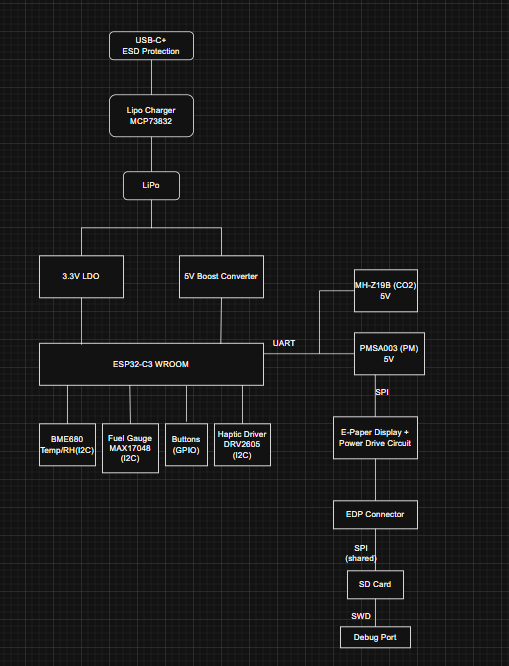

# Lotan Roberto-Gabriel

# 🔷 1. Hardware Description
## ⚡ Alimentare
### Intrare: USB-C 5V
### Încărcare baterie:
#### IC: MCP73832
#### curent setat prin rezistor (ex: 500mA)
### Baterie: LiPo 3.7V
### Conversii:
#### 3.3V:
##### LDO pentru:
###### ESP32
###### BME680
###### E-Ink logic
#### 5V:
##### Boost converter pentru:
###### PMSA003
###### MH-Z19B

### 📌 Observații:

#### Separare clară 3V3 / 5V
#### Bulk capacitors pe 5V (important pentru CO2 sensor)

## 🧠 Microcontroller
### Model: ESP32-C3
### Features:
#### RISC-V core
#### WiFi + BLE
#### SPI / I2C / UART
## 🌡️ Senzori

### BME680 (I2C)
### măsoară:
#### temperatură
#### umiditate
#### presiune
#### VOC
#### onsum mic → potrivit pentru baterie
#### MH-Z19B (UART, 5V)
#### senzor CO2 (NDIR)
#### consum mare (~100mA spikes)
#### PMSA003 (UART, 5V)
#### PM1.0 / PM2.5 / PM10
#### comunicare serială

## 🖥️ Display
### E-Ink
#### interfață: SPI
#### avantaj:
##### consum foarte mic
#### necesită:
##### circuit de power dedicat (boost + charge pump)

## 📳 Haptic
### DRV2605
### control I2C
### feedback vibrații

## 🔋 Fuel Gauge
### MAX17048
### măsoară:
#### procent baterie
#### tensiune
#### comunicare I2C

## 💾 Storage
### microSD
### interfață SPI (shared)

# Pin Maping
| Funcție    | Pin ESP32 | Motiv             |
| ---------- | --------- | ----------------- |
| I2C SDA    | GPIOx     | bus comun senzori |
| I2C SCL    | GPIOx     |                   |
| SPI MOSI   | GPIOx     | E-Ink + SD        |
| SPI MISO   | GPIOx     |                   |
| SPI CLK    | GPIOx     |                   |
| EPD CS     | GPIOx     | dedicat           |
| SD CS      | GPIOx     | separat           |
| UART TX    | GPIOx     | PMSA003           |
| UART RX    | GPIOx     | PMSA003           |
| UART2 TX   | GPIOx     | MH-Z19B           |
| UART2 RX   | GPIOx     | MH-Z19B           |
| Buttons    | GPIOx     | input             |
| Haptic INT | GPIOx     | optional          |
